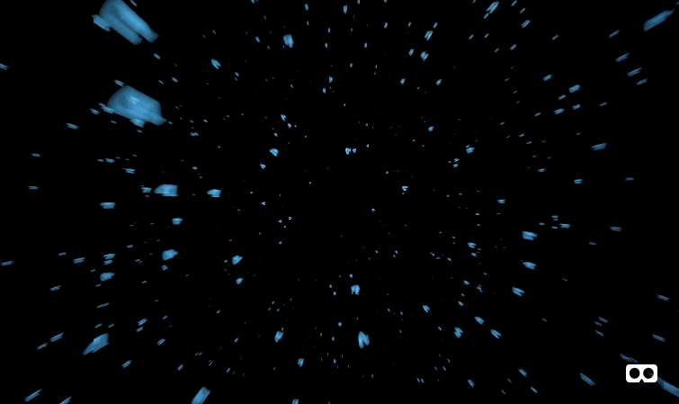

# Vimeo WebVR Demo

 

[View demo](https://vimeo-webvr-demo.glitch.me/) - [View 360 demo](https://vimeo-webvr-360demo.glitch.me/)

This demo shows you how you can stream regular and 360 videos from your own Vimeo account into a WebVR (or any WebGL experience). It's all built on top of [A-frame](https://aframe.io) & React and is powered by [Glitch](https://glitch.com).

## How to watch in VR
Check out [webvr.info](https://webvr.info/) to learn how you can view this demo on any of your VR headsets or mobile devices.

## Getting started
First you'll need to sign into your [Vimeo](https://vimeo.com) account (or create one if you haven't already) and make sure you have some videos uploaded.
> _Note: In order to stream Vimeo videos, you will need direct video file access via the Vimeo API. Accessing video files via API is limited to [Vimeo Pro and Business](https://vimeo.com/upgrade) customers._

#### 1a. Remix this demo on Glitch
[Glitch.com](https://glitch.com) is a wonderful platform that makes it pain-free to remix this demo without worrying about local or remote server setup. [Go remix this demo](https://glitch.com/edit/#!/vimeo-demo).

#### 1b. Run locally
First you will need to install Node. You will need [Homebrew](https://brew.sh/) installed first. Open up a terminal and run:

```
brew install npm
```

Then you'll need to install all the dependencies:
```
npm run install
```

Now you can bootup the server:
```
npm run start
```

You're good to go! Now you can visit `http://localhost:55293` in your browser to see your app. You won't see any videos playing... yet!

#### 2. Setting up your secret Vimeo token
We will need to use the Vimeo API so that we can grab the video files directly for WebGL to use. A Vimeo token is required so you can make authorized API calls.

To make your life easy, we [made this handy link which will generate the token for you](https://vimeo-authy.herokuapp.com/auth/vimeo/webgl). Once you have authorized the app, it will give you a token so you can paste into the `.env` file. If you're running this locally, create a `.env` file in your root folder. Your `.env` file should now look something like this:
```
VIMEO_TOKEN=406cea4d4xxxxxxxxxxe437756d036f5
```

Don't forget to restart your server after updating your `.env`.

#### 3. Playing your Vimeo video
Now that you're all setup, you can start streaming video. Check out the React file `app/demo.js` and find the following line of code:

```
<Vimeo url="https://vimeo.com/244123293" />
```

Replace the `url` with your own Vimeo video and like magic, your video should start playing!

#### 4. Customize your world
Never used [A-frame](https://aframe.io/) before? Head on over to [aframe.io](https://aframe.io/) to learn how to build your own WebVR experience!


## Known limitations
* Mobile web playback on Safari currently has a [known bug](https://bugs.webkit.org/show_bug.cgi?id=179417)


## Credits
* A-frame [aframevr/aframe](https://github.com/aframevr/aframe)
* 360 Stereo support made possible by [oscarmarinmiro/aframe-stereo-component](https://github.com/oscarmarinmiro/aframe-stereo-component)
